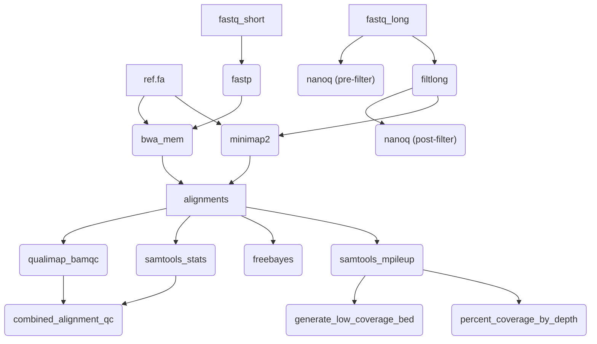

# alignment-variants

[](https://github.com/BCCDC-PHL/alignment-variants/actions/workflows/pull_request.yml)

A pipeline to align (map) reads against a reference genome, and call variants based on the alignment.

## Usage

```
nextflow run BCCDC-PHL/alignment-variants \
  --ref /path/to/ref.fa \
  --fastq_input /path/to/fastqs \
  --outdir /path/to/outputs
```

Including the `--collect_outputs` flag will add the `collected_fastp.csv` and `collected_qualimap_bamqc.csv` outputs, which include results for all samples collected into a single file.

```
nextflow run BCCDC-PHL/alignment-variants \
  --ref /path/to/ref.fa \
  --fastq_input /path/to/fastqs \
  --collect_outputs \
  --outdir /path/to/outputs
```

An alternative filename prefix can be set for the collected outputs using the `--collected_outputs_prefix` flag:

```
nextflow run BCCDC-PHL/alignment-variants \
  --ref /path/to/ref.fa \
  --fastq_input /path/to/fastqs \
  --collect_outputs \
  --collected_outputs_prefix 'test' \
  --outdir /path/to/outputs
```

...which would produce files named: `test_fastp.csv` and `test_qualimap_bamqc.csv`.

If long reads are available, they can be included with the `--fastq_input_long` flag:

```
nextflow run BCCDC-PHL/alignment-variants \
  --ref /path/to/ref.fa \
  --fastq_input /path/to/fastqs \
  --fastq_input_long /path/to/long_fastqs \
  --outdir /path/to/outputs
```

Alternatively, a `samplesheet.csv` file can be provided:

```
nextflow run BCCDC-PHL/alignment-variants \
  --ref /path/to/ref.fa \
  --samplesheet_input /path/to/samplesheet.csv \
  --outdir /path/to/outputs
```

The fields should include:

```
ID
R1
R2
```

...and if long reads are included, use the field:

```
LONG
```

...if separate reference sequences are to be used for each sample, a `REF` field can be included, with a path to the reference genome for each sample. When including the `REF` field in the samplesheet, the `--ref` flag can be omitted.

## Pipeline



## Outputs

```
output
├── SAMPLE-1
│   ├── SAMPLE-1_20231123140142_provenance.yml
│   ├── SAMPLE-1_fastp.csv
│   ├── SAMPLE-1_fastp.json
│   ├── SAMPLE-1_long.bam
│   ├── SAMPLE-1_long.bam.bai
│   ├── SAMPLE-1_short.bam
│   ├── SAMPLE-1_short.bam.bai
│   ├── SAMPLE-1_short_depths.tsv
│   ├── SAMPLE-1_short_freebayes.vcf
│   ├── SAMPLE-1_short_low_coverage_regions.bed
│   ├── SAMPLE-1_short_percent_coverage_by_depth.csv
│   ├── SAMPLE-1_short_qualimap_alignment_qc.csv
│   ├── SAMPLE-1_short_qualimap_genome_results.txt
│   └── SAMPLE-1_short_qualimap_report.pdf
├── SAMPLE-2
│   ├── SAMPLE-2_20231123140112_provenance.yml
│   ├── SAMPLE-2_fastp.csv
│   ├── SAMPLE-2_fastp.json
│   ├── SAMPLE-2_long.bam
│   ├── SAMPLE-2_long.bam.bai
│   ├── SAMPLE-2_short.bam
│   ├── SAMPLE-2_short.bam.bai
│   ├── SAMPLE-2_short_depths.tsv
│   ├── SAMPLE-2_short_freebayes.vcf
│   ├── SAMPLE-2_short_low_coverage_regions.bed
│   ├── SAMPLE-2_short_percent_coverage_by_depth.csv
│   ├── SAMPLE-2_short_qualimap_alignment_qc.csv
│   ├── SAMPLE-2_short_qualimap_genome_results.txt
│   └── SAMPLE-2_short_qualimap_report.pdf
├── collected_fastp.csv
└── collected_qualimap_bamqc.csv
```
