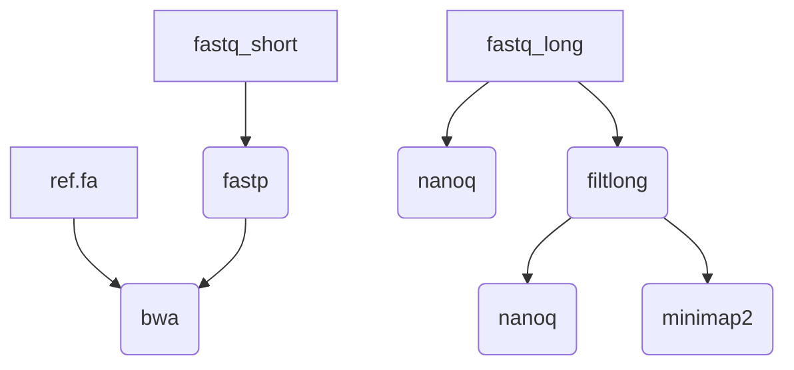

# alignment-variants

A pipeline to align (map) reads against a reference genome, and call variants based on the alignment.

## Usage

```
nextflow run dfornika/alignment-variants \
  --ref /path/to/ref.fa \
  --fastq_input /path/to/fastqs \
  --outdir /path/to/outputs
```

## Pipeline



## Outputs

TBD.

